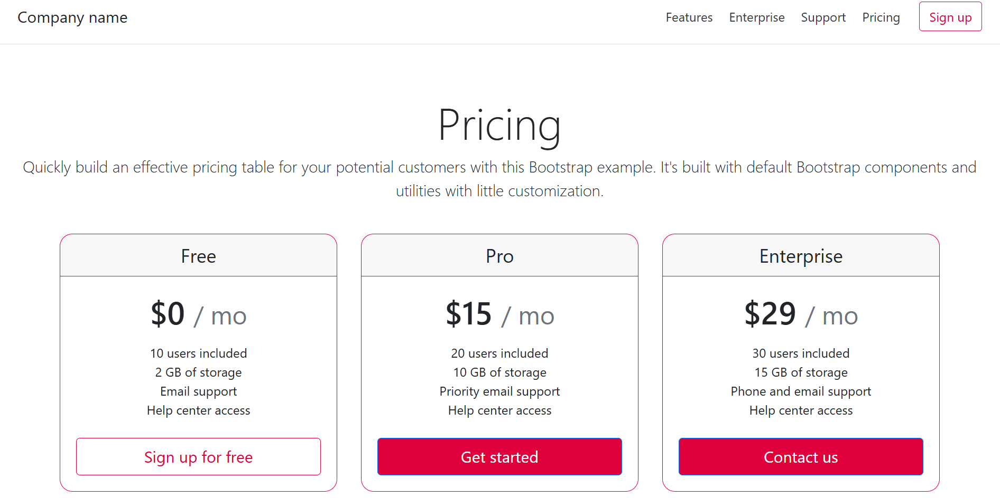

# 
Bootstrap (Max's Version)

## :bookmark: Table of Contents

        

        CLICK TO ENLARGE
        

        :memo: <a href="#description">Description</a>
         
        :school: <a href="#learning objective">Learning Objective</a>
         
        :floppy_disk: <a href="#requirements">Requirements</a>
         
        :wrench: <a href="#installation">Installation</a>
         
        :camera: <a href="#pictures">Pictures</a>
         
        :sparkles: <a href="#authors">Authors</a>

## :memo: Description

This project introduces the use of Bootstrap 4.4, focusing exclusively on CSS styling to create responsive, mobile-first web interfaces. As a foundational CSS framework, Bootstrap provides design templates for essential components like typography, forms, buttons, and navigation, which streamline front-end development.

## :school: Learning Objective

Key skills developed:

- Effective use of containers for layout structuring.
- Mastery of the grid system to create responsive designs.
- Utilization of Bootstrap's built-in components.
- Application of utility classes for consistent styling.

## :floppy_disk: Requirements

- Bootstrap 4.4.1 should be used via a CDN link added in the (<head>) section of the HTML

## :wrench: Installation

**Clone the repository**

`git clone https://github.com/Jaylenperez/Bootstrap.git`
`cd Bootstrap`

## :camera: Photos

## :sparkles: Authors

**Jaylen Perez**

- Github: [@Jaylenperez](https://github.com/Jaylenperez)
